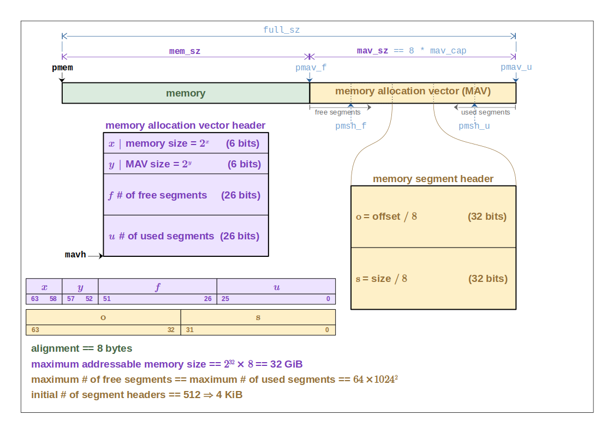

# Memory management

## Development notes

The variables and functions that start with an `_` should not be accessed by code outside of
`memory` package.

## Linear scheme

The memory layout for the linear allocator is depicted below:

The memory layout is a linear area of memory that is composed of the allocatable memory block
(depicted in green) followed by the **memory allocation vector** (MAV, depicted in yellow).

Two global values (in black) are used to manage all the information in the diagram above:

* **`pmem`** that points to the begin of allocatable memory is stored in variable `_mem_pbase`;
* **`mavh`** that stores the **memory allocation vector header** (MAVH, depicted in purple) is
  stored in variable `_linear_mavh` of 64 bits that:
  * $x$ is a value stored in upper 6 bits such that memory size is given by $mem_{sz}=2^x$
  * $y$ is a value stored in the next 6 bits such that MAV size is given by $mav_{sz}=2^y$
  * $f$ is the number of free segments in MAV stored in the next 26 bits
  * $u$ is the number of used segments in MAV stored in the lower 26 bits

MAV is composed of a sequence of **memory segment headers** (MSH, depicted in yellow). The maximum
number of MSHs in MAV is given by $mav_{cap} = mav_{sz}/8$.

An MSH is a 64 bit value composed of:

* $o$ is the value stored in the upper 32 bits such that the offset of the begining of the block is
  given by $\mathit{offset} = o \times 8$
* $s$ is the value stored in the lower 32 bits such that the block size is given by $size = s \times 8$

The filling of MAV is done as (depicted in gray arrows below MAV):

* free segments are populated from left to right (increasing memory addresses) sorted in ascending
  order of block offsets starting at $pmav_{f}=pmem + mem_{sz}$;
* used segments are populated from right to left (decreasing memory addresses) sorted backward in
  ascending order of block offsets starting at $pmav_{u}=pmav_{f} + mav_{sz}$;
